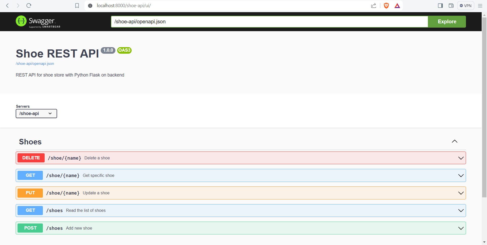
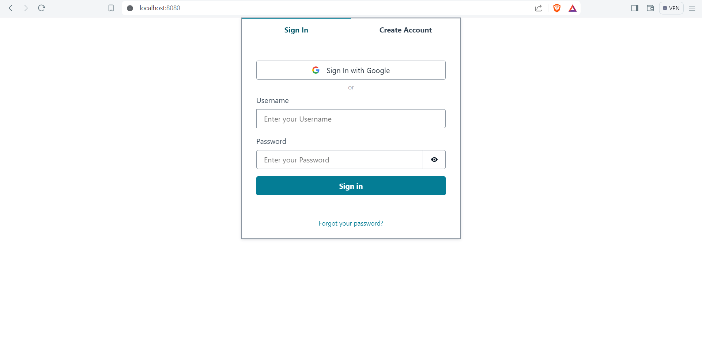
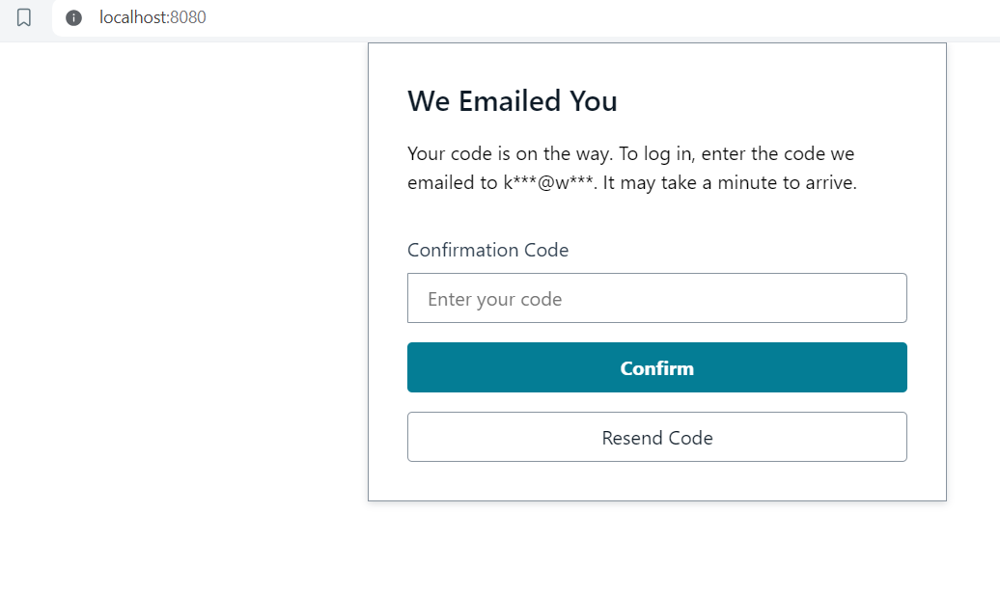
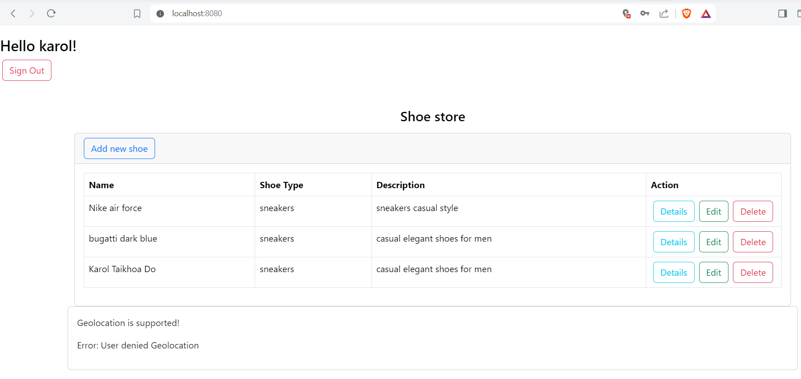

# Shoes-store
basic rest web app with CRUD operations build with vue js and flask python

# Features
- scalable backend structure with 'models' and 'services'
- ui for testing rest api
- saving data (shoes) to small file-database (SQLAlchemy)
- User authentication with Google (AWS Amplify)
- CRUD operations on model 'shoe'
- geolocation (for testing)

# Future work
- securing webapp e.g. https, managing user access
- contenerize
- ui features e.g. dark mode theme
# Prerequisites
- npm (node package manager) for frontend with vue js
- python, pip (package installer for python) for backend with flask python

It's also recommended to setup virtual environment before running the program for the 1st time.
`python -m venv <name of virtual environment e.g. venv>`

Then activate the venv.

Configure AWS Amplify for user authentication

# Requirements
For flask python go to `flask_backend` and run command:
`pip install -r requirements.txt`

# Usage
First, spin up the backend. Go to `flask_backend` and run:
`python main.py`

You can check out the UI for flask rest api (build with Swagger).
Go to `localhost:8000/shoe-api/ui`

Secondly, run the frontend. Go to `vue_client/shop-store-web` and run :
`npm serve run`.

Then go to `localhost:8080` and you will be prompted to log in.

